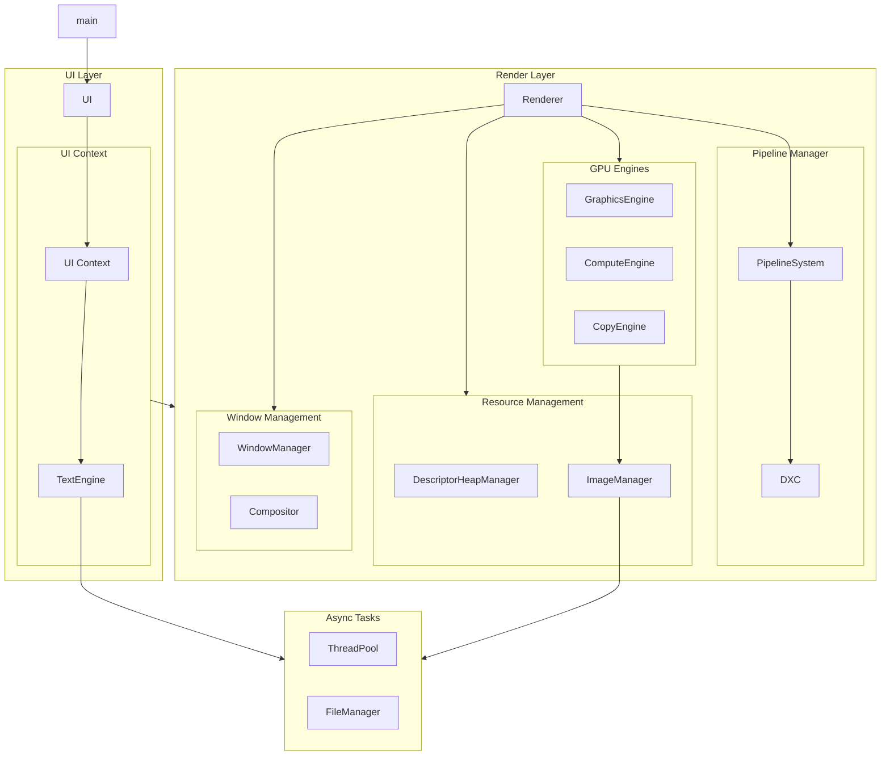

# TK
> 大変に気分がいい！

A visual novel engine designed to make visual novel creation accessible to everyone.

Is still in the early stages of development.

## TODO
- [ ] Add more controls to the UI framework.
- [ ] Implement font selection and vertical text layout.
- [ ] Add MSDF glyph cache files generation and preloading.
- [ ] Add IME support.
- [ ] Add audio processing.
- [ ] Implement an audio player for testing.
- [ ] Add video processing.
- [ ] Implement a video player for testing.
- [ ] Design the visual novel runtime system.
- [ ] Implement a scripting language for creating visual novels.

## Architecture


## Build
Open cmd.
```cmd
git clone https://github.com/myc123abc/tk
cd tk
cmake -Bbuild -GNinja .
cmake --build build
```

## External Libraries

| Library | License | Link |
|--|--|--|
|DirectX-Headers|MIT|https://github.com/microsoft/DirectX-Headers|
|freetype|FLT|https://gitlab.freedesktop.org/freetype/freetype|
|harfbuzz|Old MIT|https://github.com/harfbuzz/harfbuzz|
|libunibreak|Zlib|https://github.com/adah1972/libunibreak|
|stb|MIT|https://github.com/nothings/stb|
|utfcpp|MIT|https://github.com/nemtrif/utfcpp|
|Clipper2|BSL-1.0|https://github.com/AngusJohnson/Clipper2|
|msdfgen|MIT|https://github.com/Chlumsky/msdfgen|
|tk-util|Public Domain|https://github.com/Myc123abc/tk-util|

## License
The following licenses are available:
* Public Domain
* MIT No Attribution
